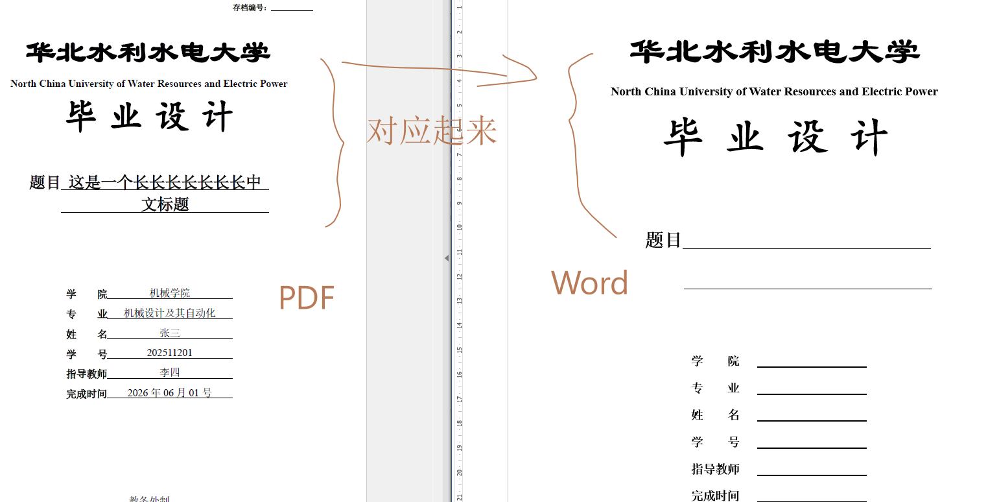
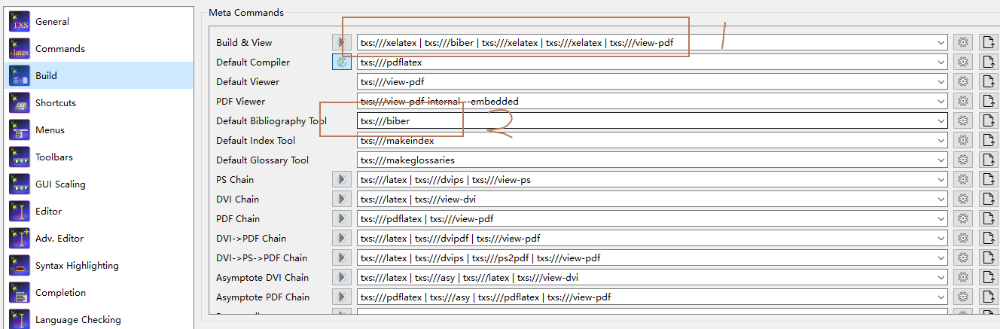
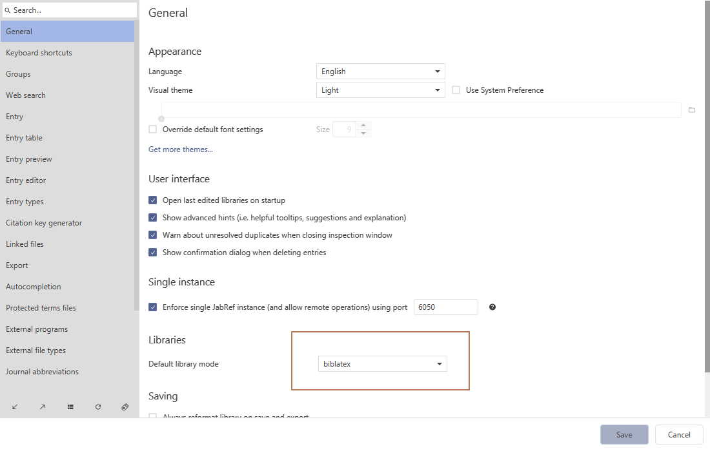
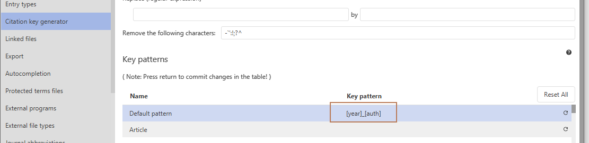

# NCWU_bachelorThesis_Latex(Updating)
# 华北水利水电大学本科毕设Latex模版使用说明（持续更新）

## 步骤1: 安装Texlive + TeXstudio 编译和编辑环境（以下任一）
Texlive.iso 安装包比较大，网络不好的同学可以找小组长拷贝。U盘需要有10G左右的内存。

  1. [2025最新TexLive+TexStudio完整安装与使用教程](https://blog.csdn.net/weixin_44807931/article/details/145368442)
  2. [2025 最新LaTeX【texlive+TeXstudio】安装保姆教程](https://zhuanlan.zhihu.com/p/1921310237857648721)
  3. [LaTeX环境搭建指南：TeX Live与TeXstudio安装全流程](https://comate.baidu.com/zh/page/8tk70692bec)

## 步骤2: 安装JabRef参考文献管理软件（以下任一）
  1. [Install](https://docs.jabref.org/installation)
  2. [JabRef Windows版4.3.1文献管理工具实战应用](https://blog.csdn.net/weixin_36464343/article/details/153874099)
  3. [【LaTeX】7. jabref的安装](https://www.bilibili.com/video/BV1jR4y1t7tE/?vd_source=cfd6e27f8c14e6094c8c84163b73c627)
  4. [Jabref安装及使用教程](https://www.cnblogs.com/qixianyu/p/6657363.html)
   
## 步骤3: 下载华北水利水电大学毕设模版
  1. 现场拷贝。
  2. [华北水利水电大学本科毕设Latex模版](https://github.com/DrHanks91/NCWU_bachelorThesis_Latex)。进入网址--点击Code--下载Zip--解压待使用。
   

## 步骤4: 安装Fonts文件下字体
将Font文件下字体进行安装，采用右键--为所有用户安装。

保证打开【毕业设计（论文）格式和要求.doc】时首页与【NCWU_bachelorThesis_Latex】下的【main.pdf】字体显示一致，不然则为字体安装未成功。


## 步骤5: 配置TeXstudio
打开 TeXstudio ，点击【Options】-- 【Configure TeXstudio】，对以下两项进行修改。


修改默认编译方式：XeLaTex--Biber--XeLaTex--XeLaTex--View，可以采用点击右侧小齿轮修改编译顺序，或者直接复制以下内容：
```
txs:///xelatex | txs:///biber | txs:///xelatex | txs:///xelatex | txs:///view-pdf
```

修改默认参考文献工具为Biber，可以采用点击下拉箭头，或者直接复制以下内容：
```
txs:///biber
```
## 步骤6: 开始编译
在 TeXstudio 中，打开【NCWU_bachelorThesis_Latex】下的【main.tex】文件。之后进行编译，点击工具栏中双播放小按钮或者按【F5】快捷键。

首次编译可能需要时间较长，后续会大大缩短编译时间。


## 步骤7: 配置JabRef
对JabRef作两处更改。

修改1: 点击【File】--【Preferences】，修改文档格式为【biblatex】


修改2: 文献key的生成格式为【[year]_[auth]】，或者复制：
```t
[year]_[auth]
```

如没有完成修改，可能是没有在输入之后点击回车。



导入和导出参考文献，可以进行自行学习。

## 步骤8: 编写内容
可以对照模版中第6章学习，或者复制对应格式内容。修改部分文字，或者段落，可以进行编译，查看文档结果。

至此，已经完成所有配置，大家可以享用华北水利水电大学本科毕业设计（论文）Latex模版了。

祝您鹏程万里。

# 联系作者
于仓促间完成本稿，难免有疏漏之处，请多见谅。如有更改或者其他需求，可以联系作者。

通过邮件[haiquan-wang@outlook.com](mailto:haiquan-wang@outlook.com)

谢谢您的支持。